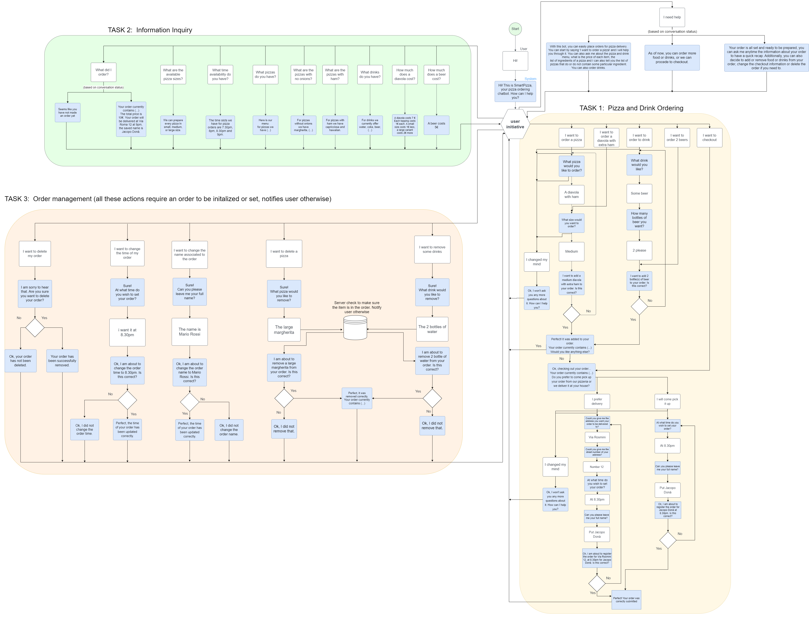

# HMD Project

### Domain
Pizza ordering bot

### Available Actions
- Order pizza(s)
- Order drink(s)
- Checkout order
  - Specify delivery or takeaway
- Ask for price of pizza/drink
- Ask for ingredients in pizza
- Ask for menu
- Ask for pizza with/without ingredient
- Ask for pizzeria location
- Ask for timings of pizzeria
- Ask for help
- Modify placed order
  - Add pizza
  - Remove pizza
  - Add drink 
  - Remove drink
  - Change time
  - Change name
  - Change delivery method
  - Delete order

### Video Demo
Some examples of bot usage are available [here](https://drive.google.com/drive/folders/1uTy8famUhQ5_rOpVg44SVAuR_zXsm5Yc?usp=sharing).

### Training the model

```
rasa train -c config.yml
```

A pretrained model using config.yml is also available in /models folder.

### Running the bot locally

Open two terminals, on one type:

```
rasa run actions
```
to start the action server. In the other type:
```
rasa shell
```
to start the conversational agent.

### Deploy on alexa

Open two terminals, on one type:

```
rasa run actions
```
to start the action server. In the other type:
```
rasa run -m models --endpoints endpoints.yml -p 5005 --credentials credentials.yml
```
to start the conversational agent.

Open ngrok and run 
```
ngrok http 5005
```
It should give an https url, go to the alexa skill endpoint and copy the URL, appending the suffix "/webhooks/alexa_assistant/webhook"

To Alexa, say "Start Pizza Bot"

### Dialogue Flowchart
